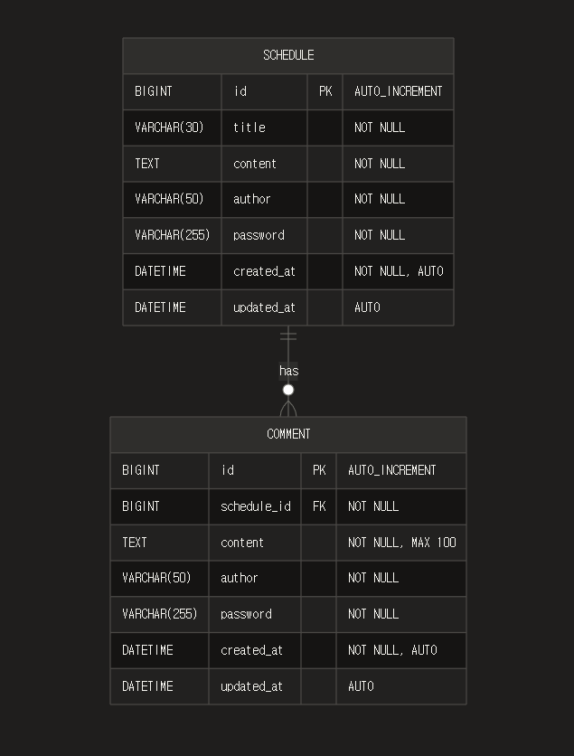

# java-schedule-manager

## 1. EDR



- Schedule 1개 ↔ Comment 다수 (OneToMany)
- Comment는 최대 10개 제한

## 2. API 명세

Base URL : http://localhost:8080/api

### 1. 일정(Schedule) API

#### 1.1 일정 생성
POST /schedules

Request Body
```json
{
"title": "회의 일정",
"content": "팀 회의 진행",
"author": "홍길동",
"password": "1234"
}
```

Validation
* title: 필수, 최대 30자
* content: 필수, 최대 200자
* author: 필수
* password: 필수

Response (201 Created)
```json
{
"id": 1,
"title": "회의 일정",
"content": "팀 회의 진행",
"author": "홍길동",
"createdAt": "2026-01-02T10:00:00",
"updatedAt": "2026-01-02T10:00:00"
}
```

#### 1.2 전체 일정 조회
GET /schedules

Query Parameters
* author (optional): 작성자명으로 필터링

Example
````
GET /schedules
GET /schedules?author=홍길동
````

Response (200 OK)
```json
[
{
"id": 1,
"title": "회의 일정",
"content": "팀 회의 진행",
"author": "홍길동",
"createdAt": "2026-01-02T10:00:00",
"updatedAt": "2026-01-02T10:00:00"
},
{
"id": 2,
"title": "프로젝트 마감",
"content": "최종 제출",
"author": "김철수",
"createdAt": "2026-01-01T15:30:00",
"updatedAt": "2026-01-01T15:30:00"
}
]
```
정렬: 수정일(updatedAt) 내림차순

#### 1.3 단건 일정 조회 (댓글 포함)
GET /schedules/{id}

Path Variable
* id: 일정 ID

Response (200 OK)
```json
{
"id": 1,
"title": "회의 일정",
"content": "팀 회의 진행",
"author": "홍길동",
"createdAt": "2026-01-02T10:00:00",
"updatedAt": "2026-01-02T10:00:00",
"comments": [
{
"id": 1,
"content": "참석하겠습니다",
"author": "김철수",
"createdAt": "2026-01-02T11:00:00",
"updatedAt": "2026-01-02T11:00:00"
},
{
"id": 2,
"content": "시간 확인 부탁드립니다",
"author": "이영희",
"createdAt": "2026-01-02T11:30:00",
"updatedAt": "2026-01-02T11:30:00"
}
]
}
```

Error (404 Not Found)
```json
{
"message": "해당 일정이 존재하지 않습니다."
}
```

#### 1.4 일정 수정
PUT /schedules/{id}

Path Variable
* id: 일정 ID

Request Body
```json
{
"title": "회의 일정 변경",
"author": "홍길동",
"password": "1234"
}
```

Response (200 OK)
```json
{
"id": 1,
"title": "회의 일정 변경",
"content": "팀 회의 진행",
"author": "홍길동",
"createdAt": "2026-01-02T10:00:00",
"updatedAt": "2026-01-02T12:00:00"
}
```

Error (400 Bad Request)
```json
{
"message": "비밀번호가 일치하지 않습니다."
}
```

#### 1.5 일정 삭제
DELETE /schedules/{id}

Path Variable
* id: 일정 ID

Request Body
```json
{
"password": "1234"
}
```

Error (400 Bad Request)
```json
{
"message": "비밀번호가 일치하지 않습니다."
}
```
참고: 일정 삭제 시 연관된 모든 댓글도 자동 삭제됩니다 (CASCADE)

### 2 댓글(Comment) API

#### 2.1 댓글 작성
POST /schedules/{scheduleId}/comments

Path Variable
* scheduleId: 일정 ID

Request Body
```json
{
"content": "참석하겠습니다",
"author": "김철수",
"password": "1234"
}
```

Validation
* content: 필수, 최대 100자
* author: 필수
* password: 필수

Response (201 Created)
```json
{
"id": 1,
"content": "참석하겠습니다",
"author": "김철수",
"createdAt": "2026-01-02T11:00:00",
"updatedAt": "2026-01-02T11:00:00"
}
```

Error (400 Bad Request)
```json
{
"message": "댓글은 최대 10개까지 작성할 수 있습니다."
}
```

```json
{
"message": "일정이 존재하지 않습니다."
}
```

## 기술 스택
Framework: Spring Boot 4.0.1

ORM: JPA/Hibernate

Database: MySQL

Validation: Jakarta Validation API

Auditing: Spring Data JPA Auditing